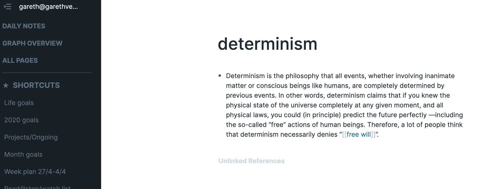
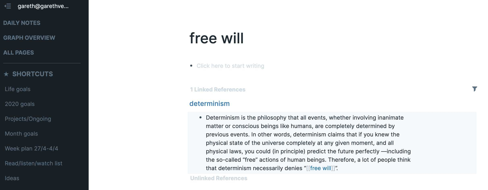
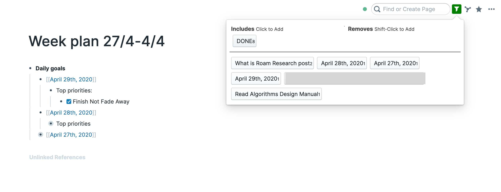
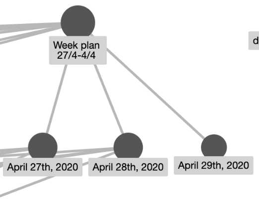
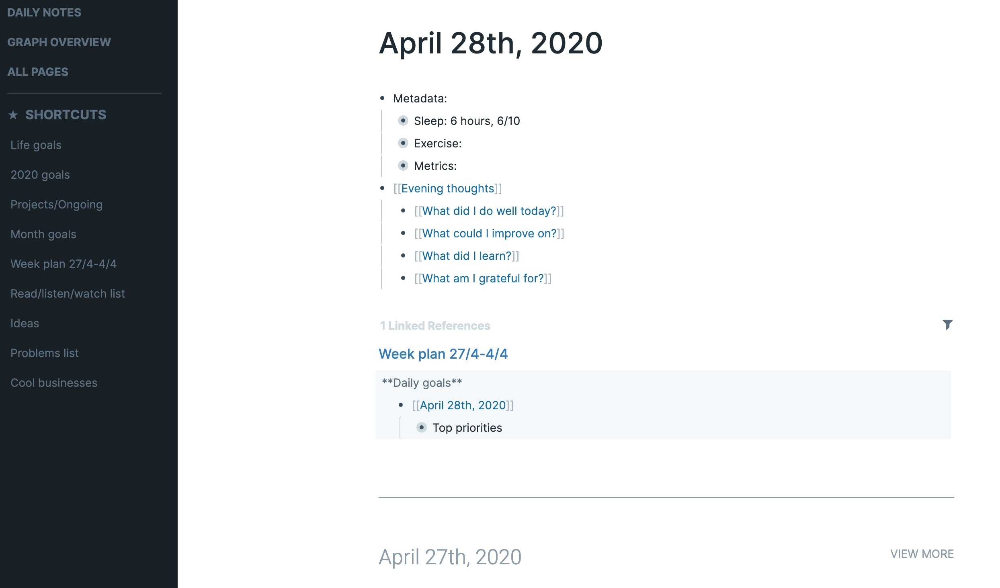
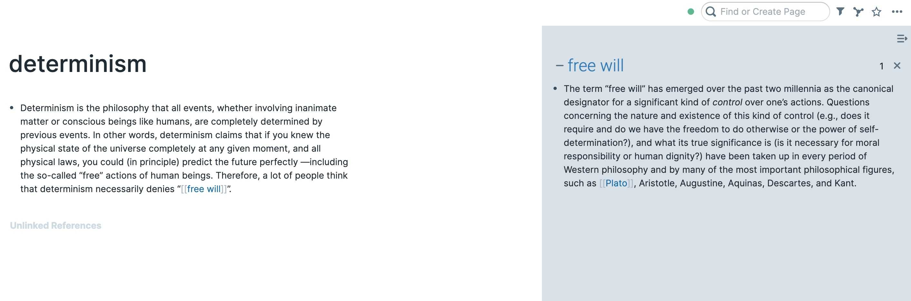

I’ve been using a combintation of Evernote, OneNote, Keep Notes and Google sheets to organise my goals, life, learning, and personal projects. This system has always felt pretty unorganised, i’d take notes in one app, but forget to update others. This has been leaving me with an array of unorganised thoughts and an unfocused learning strategy. Then I came across Roam Research… This completely reshaped my system, keeping me more focused on my goals and boosting my productivity. In this post I talk about what this is and why i’ve been recommending it so much. I will write some follow ups detailing my system among other topics related to Roam.

> Throughout this post I use the words ‘page’ and ‘note’ interchangeabley to refer to each page created in Roam.

### What exactly is Roam Research? And why is it so good?

Roam is the next generation of ‘second brain’ software or note taking tools. It’s designed to mimic your brain’s structure, where knowledge and information is not stored in a hierarchical manner. Roam instead, stores information more like a mind map, where information is added and referenced around central concepts. This offers a visual representation of how information is linked and creates an interlinked network of ideas/thoughts/information.

The benefits of this i’ve found to be are three fold:

**Network of knowledge**

Firstly, visionairies such as Bill Gates and Charlie Munger have talked about knowledge at length. To remember (and truly understand) what you read or learn, they suggest constructing a framework of knowlege. By placing each new idea or concept into that framework you will better understand it’s relationship to what you already know, enhancing your understanding of the bigger picture. The good news is Roam does this for you. It will automatically create references between your notes based on the words in each. You can enforce these references further by using ‘bi-directional links’. Additionally, it’ll display a visualisation of the relationships between your notes through a graph (or mind map), both of which are presented below.

**Organisation**

Secondly, by creating this interlinked system of ‘notes’, Roam can be leveraged to organise your goals, tasks, projects, and learning. A page may become a list of projects or concepts, that in turn links to each relevant project or piece of information, where more detail is held within. This has been powerful for me, and I have adapted the <a href="https://fortelabs.co/blog/para/" target="_blank">PARA</a> productivity system which ensures my daily, weekly and monthly tasks are ultimately directed towards my long term goals. I’ll present the system i’ve implemented within Roam in an upcoming post.

**Reflection**

Lastly, I won’t delve into the benefits of reflection through journalling here, but in short, you should consider doing it. By journalling in roam, the links created between pages automatically within your network of notes can identify patterns in your thinking. This can be done through the automatic linking, allowing you to visualise trends and relationships between positive or negative experiences based on your journal entries. This strategy would otherwise be very time consuming when journalling on paper.

### How does it do all of this magic?

Roam has a few key features that make it so powerful, i’ll cover each briefly below as a short introduction to get you started.

**Bi-directional links and references**

The bi-directional links are the magic in Roam. You can think of them as hyperlinks to each of your notes. You can create these by highlighting text and double clicking [[, this constructs a new page for that word (if one doesn’t exist), or simply links to the page with that name. Below I have added 2 [] around the word ‘free will’, this creates a clickable link.

As you can see, once you click this link, a page is created and it’s reference is presented at the bottom.

**Filtering/searching**

You can also filter the active note to only display relevant links/information. You can also see that each time you create a checkbox (by type /todo) they will be filterable, and once you check them off, they are tagged as ‘done’. Futher, you can search each of your notes for keywords etc.

Filtering on ‘DONE’ will hide all but these bullet points (‘DONE’ is set automatially when you tick off a ‘TODO’). Of course, this isn’t just applicable to bullet points, but also to any links within a page.

**Mind Mapping**

Roam has a ‘Graph Overview’ feature which automatically create a graph (or mind map) of the relationships between your notes. Allowing you to visualise this network of knowledge previously discussed. The image below shows the relationships between one of my week plan notes, and the daily notes (see below) referened within.

**Daily notes**

Roam has a feature named ‘daily notes’, this automatically creates a page titled with today’s date, allowing you to scribble notes for that day. I tend to use this a journal entry and a way to track my tasks on a given day.

**Sidebar**

The sidebar allows you to view or scroll through multiple pages at once. You can shift-click a bi-directional link or favourited note to open it up.

### So what?

If this post has piqued your interest you can check out Roam Research <a href="https://roamresearch.com/" target="_blank">here
</a>. In an effort to not repeat what’s already been written i’ve included some helpful links to get started below. There is a tiny learning curve to understanding how to use Roam, but, as with most things, you get out what you put in.

In closing, honestly this tool has made a seismic impact to my organisation and how i’m working towards my goals, i’ve already recommend it a handful of times in the last few weeks and will continue to do so. The system i’ve implemented would not be otherwise possible if it wasn’t for the way Roam works. I’m a huge believer in ensuring your daily actions are progressing you towards your long term goals, and this system is helping me manage that. Feel free to shoot me an email below if you have any questions and let me know what you think.

### Further reading

- <a href="https://nesslabs.com/roam-research-beginner-guide" target="_blank">How to get started - a beginner’s guide
</a>
- <a href="https://www.nateliason.com/blog/roam" target="_blank">Nate Liason’s post</a>, this is pretty extensive and includes his system/uses of Roam
- <a href="https://www.reddit.com/r/RoamResearch/" target="_blank">Roam Research reddit</a>
